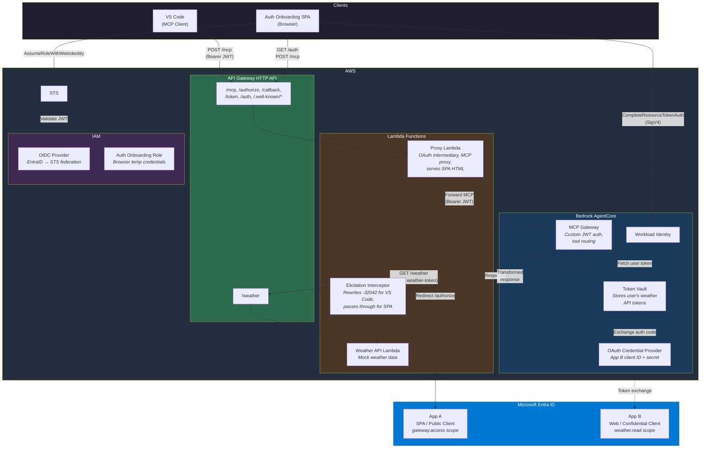
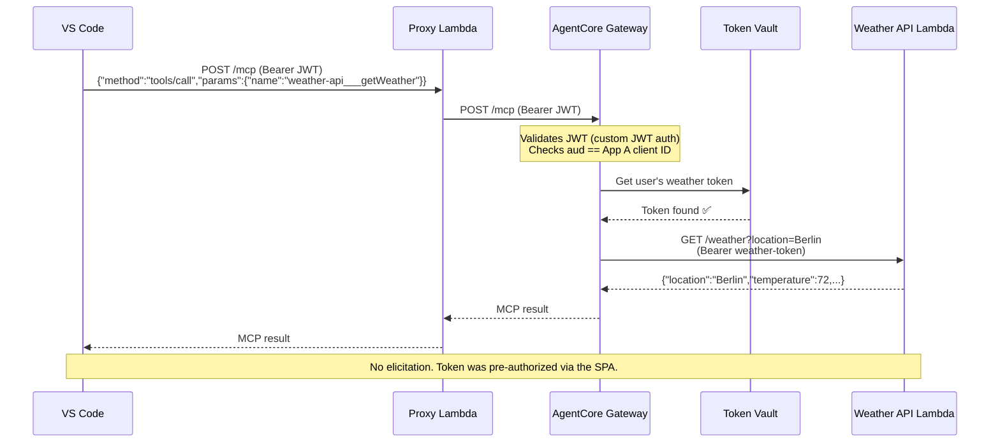
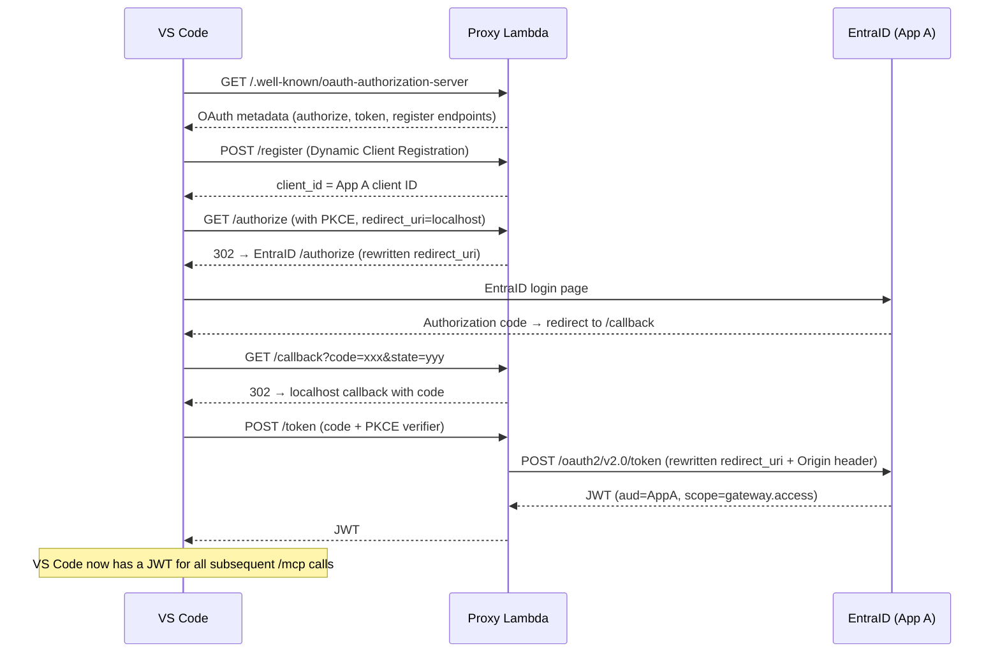

# End-to-End 흐름: EntraID 3LO를 사용하는 AgentCore Gateway

이 문서에서는 EntraID 인바운드 인증과 다운스트림 API에 대한 사용자 위임 액세스용 아웃바운드 3LO(three-legged OAuth)를 사용하는 AgentCore MCP Gateway의 전체 작동 흐름을 설명합니다.

## 시스템 개요

```
┌─────────────────────────────────────────────────────────────────────────┐
│                         COMPONENTS                                     │
├─────────────────────────────────────────────────────────────────────────┤
│                                                                        │
│  EntraID (CIAM tenant)                                                 │
│  ├── App A: agentcore-gateway-inbound (SPA, public client)             │
│  │   └── Shared identity for VS Code + Auth Onboarding SPA             │
│  └── App B: agentcore-weather-api (Web, confidential client)           │
│      └── Resource server exposing weather.read scope                   │
│                                                                        │
│  AWS                                                                   │
│  ├── API Gateway HTTP API (proxy endpoint)                             │
│  ├── Proxy Lambda (OAuth metadata, authorize/callback/token, MCP proxy)│
│  ├── Weather API Lambda (mock weather data)                            │
│  ├── AgentCore Gateway (MCP protocol, custom JWT auth)                 │
│  ├── AgentCore Token Vault (stores user's weather API tokens)          │
│  ├── OAuth Credential Provider (App B client ID + secret)              │
│  ├── IAM OIDC Provider (EntraID → STS federation)                      │
│  └── IAM Role: auth-onboarding-web-role (browser temp credentials)     │
│                                                                        │
│  Clients                                                               │
│  ├── VS Code (MCP client, uses proxy Lambda)                           │
│  └── Auth Onboarding SPA (browser-based, pre-authorizes 3LO)          │
│                                                                        │
└─────────────────────────────────────────────────────────────────────────┘
```

## AWS 아키텍처



## 두 흐름과 하나의 Token Vault

동일한 사용자 identity와 token vault를 공유하는 두 가지 클라이언트 흐름이 있습니다.

1. **Auth Onboarding SPA** - 사용자가 3LO 액세스를 미리 승인하는 브라우저 기반 웹 앱
2. **VS Code MCP Client** - proxy를 통해 도구를 호출하는 IDE 기반 MCP 클라이언트

두 흐름 모두 동일한 EntraID App A에서 인증하므로 같은 사용자의 JWT `sub` claim은 동일합니다. SPA를 통해 권한이 부여된 토큰은 VS Code에서 즉시 사용할 수 있습니다.

---

## 흐름 1: Auth Onboarding(최초 권한 부여)

사용자는 VS Code에서 다운스트림 API를 사용하기 전에 auth onboarding 웹 앱을 방문하여 액세스를 미리 승인합니다.

```mermaid
sequenceDiagram
    participant B as Browser (SPA)
    participant EA as EntraID (App A)
    participant STS as AWS STS
    participant PL as Proxy Lambda
    participant GW as AgentCore Gateway
    participant TV as Token Vault
    participant EB as EntraID (App B)
    participant AC as AgentCore Identity

    rect rgb(30, 40, 60)
    Note over B,AC: Phase 1 — User signs in
    B->>PL: GET /auth
    PL-->>B: SPA HTML page (static)
    B->>EA: MSAL.js loginRedirect (PKCE)<br/>scope: openid profile email + gateway.access
    EA-->>B: JWT (aud=AppA, sub=user)
    Note over B: JWT stored in browser sessionStorage
    end

    rect rgb(40, 30, 60)
    Note over B,AC: Phase 2 — Check authorization status
    B->>PL: POST /mcp (Bearer JWT)<br/>{"method":"tools/call","params":{"name":"weather-api___getWeather"}}
    PL->>GW: POST /mcp (Bearer JWT)
    GW->>TV: Get user's weather token
    TV-->>GW: Not found
    GW-->>PL: Error -32042 (elicitation)<br/>authorizationUrl + session_id
    PL-->>B: Error -32042 with authorizationUrl
    Note over B: Shows "Authorization needed" + Authorize button<br/>Saves JWT + roleArn to sessionStorage
    end

    rect rgb(60, 40, 30)
    Note over B,AC: Phase 3 — User consents
    Note over B: User clicks Authorize
    B->>AC: Follow authorizationUrl
    AC->>EB: Redirect to EntraID consent<br/>scope: weather.read
    Note over EB: User sees "Allow Weather API to read weather data?"
    EB-->>AC: Authorization code
    Note over AC: Exchanges code for weather token<br/>using App B client secret
    AC->>TV: Store user's weather token
    AC-->>B: Redirect to /auth/callback?session_id=xxx
    end

    rect rgb(30, 55, 35)
    Note over B,AC: Phase 4 — Complete authorization (browser-side SigV4)
    B->>PL: GET /auth/callback?session_id=xxx
    PL-->>B: Callback HTML page (static)
    Note over B: Reads JWT from sessionStorage<br/>Reads session_id from URL
    B->>STS: AssumeRoleWithWebIdentity(JWT)
    STS-->>B: Temporary AWS credentials (1h)
    B->>AC: CompleteResourceTokenAuth(sessionUri, userToken)<br/>[SigV4 signed with temp creds]
    Note over AC: Validates JWT matches the user who initiated the flow<br/>Binds the stored token to this user<br/>(accesses Secrets Manager via FAS internally)
    AC-->>B: Success
    Note over B: Shows "Authorization Successful"
    end
```



### 각 단계의 동작

1. 사용자가 `https://<endpoint>/auth`를 방문하면 proxy Lambda가 SPA HTML을 제공합니다.
2. MSAL.js가 PKCE를 통해 EntraID 로그인을 처리하고 `gateway.access` scope가 포함된 JWT를 가져옵니다.
3. SPA가 `tools/call getWeather`와 함께 `POST /mcp`를 호출합니다. VS Code가 보내는 요청과 동일합니다.
4. Gateway가 token vault에서 사용자의 weather API token을 확인하지만 찾지 못합니다.
5. Gateway가 `authorizationUrl`이 포함된 elicitation(-32042)을 반환합니다.
6. SPA가 Authorize 버튼을 표시합니다. 사용자가 버튼을 클릭하면 JWT와 role ARN이 sessionStorage에 저장됩니다.
7. 브라우저가 AgentCore의 authorize URL에서 EntraID 동의 페이지로 redirect됩니다.
8. 사용자가 동의하면 EntraID가 AgentCore의 callback으로 authorization code를 전송합니다.
9. AgentCore가 Secrets Manager의 App B client secret을 사용해 code를 weather token으로 교환합니다.
10. AgentCore가 token vault에 토큰을 저장하고 `/auth/callback?session_id=xxx`로 redirect합니다.
11. Callback 페이지가 sessionStorage에서 JWT를 읽고 STS `AssumeRoleWithWebIdentity`를 호출해 임시 AWS 자격 증명을 가져옵니다.
12. Callback 페이지가 SigV4를 통해 `CompleteResourceTokenAuth`를 직접 호출하며 Lambda proxy는 관여하지 않습니다.
13. 완료되었습니다. 토큰이 vault에 저장되고 이 사용자에게 바인딩됩니다.

---

## 흐름 2: VS Code MCP(권한 부여 후 정상 경로)

사용자가 SPA를 통해 권한을 부여한 후에는 elicitation 없이 VS Code MCP 호출이 작동합니다.



---

## 흐름 3: VS Code Inbound OAuth(최초 연결)

VS Code가 MCP 서버에 처음 연결할 때 인바운드 인증을 위한 표준 OAuth 2.1 흐름을 거칩니다. 이 흐름은 3LO outbound auth와 별개입니다.



### inbound auth에서 Proxy Lambda의 역할

proxy Lambda는 VS Code와 EntraID 사이에서 OAuth intermediary 역할을 합니다.

- `/authorize` - `redirect_uri`를 proxy의 `/callback`으로 재작성하고, 원래 redirect_uri를 state 파라미터에 인코딩하며, `gateway.access` scope를 주입합니다.
- `/callback` - 복합 state를 디코딩하고 authorization code를 VS Code의 원래 redirect_uri로 전달합니다.
- `/token` - `resource` 파라미터를 제거하고(EntraID v2.0에서 지원하지 않음), `Origin` header를 추가하며(SPA/public client token redemption에 필요), `redirect_uri`를 재작성합니다.
- `/register` - 사전 등록된 App A client_id를 반환합니다(dynamic registration 불필요).

---

## 주요 설계 결정

### auth 상태 확인에 `tools/list` 대신 `tools/call`을 사용하는 이유

`tools/list`는 outbound auth를 시작하지 않습니다. weather API token 없이 사용 가능한 도구 목록을 반환합니다. 실제로 도구를 호출하는 `tools/call`만 Gateway가 weather token을 가져오도록 하며, 토큰이 없으면 elicitation을 시작합니다.

### credential provider에 `CustomOauth2` vendor type을 사용하는 이유

EntraID tenant는 CIAM(External ID) tenant입니다. CIAM tenant는 token endpoint에 `login.microsoftonline.com`이 아니라 `ciamlogin.com`을 사용합니다. `MicrosoftOauth2` vendor type은 discovery URL을 `login.microsoftonline.com`으로 자동 생성하므로 token exchange가 실패합니다. `CustomOauth2`를 사용하면 올바른 CIAM discovery URL을 명시적으로 지정할 수 있습니다.

### 브라우저가 `CompleteResourceTokenAuth`를 직접 호출하는 이유(Lambda proxy 없음)

callback 페이지는 STS `AssumeRoleWithWebIdentity`의 임시 AWS 자격 증명으로 SigV4 서명을 사용해 브라우저에서 `CompleteResourceTokenAuth`를 직접 호출합니다. 따라서 auth 완료 흐름에서 Lambda proxy가 완전히 제외됩니다.

브라우저 역할의 `secretsmanager:GetSecretValue`에는 `aws:CalledVia: bedrock-agentcore.amazonaws.com` 조건이 적용됩니다. 브라우저는 GetSecretValue를 직접 호출할 수 없지만, AgentCore가 `CompleteResourceTokenAuth` 처리 중 Forward Access Sessions(FAS)를 통해 내부적으로 호출하면 조건을 충족합니다. 이 패턴은 AWS 관리형 `BedrockAgentCoreFullAccess` 정책에서 가져왔습니다.

브라우저는 jsDelivr ESM CDN에서 AWS SDK v3(`@aws-sdk/client-sts`, `@aws-sdk/client-bedrock-agentcore`)를 로드합니다. 흐름은 다음과 같습니다.
1. sessionStorage에서 JWT 읽기(동의 redirect 전에 저장)
2. STS `AssumeRoleWithWebIdentity(JWT)` → 임시 자격 증명
3. SigV4로 `CompleteResourceTokenAuth(sessionUri, userToken)` 호출

따라서 JWT는 브라우저를 벗어나지 않으며 DynamoDB, Lambda proxy, 서버 측 저장소가 필요하지 않습니다.

### Gateway authorizer에 `allowedClients`가 없는 이유

EntraID v2.0 토큰은 client ID에 `client_id`가 아니라 `azp`를 사용합니다. AgentCore는 EntraID v2.0 토큰에 없는 `client_id` claim을 기준으로 `allowedClients`를 검증합니다. 대신 `aud`를 기준으로 검증되는 `allowedAudience`를 사용합니다.

### proxy Lambda가 자체 boto3를 번들로 제공하는 이유

Lambda Runtime의 내장 boto3는 너무 오래되어 `complete_resource_token_auth`가 없을 수 있습니다. CDK 번들링 단계에서 최신 boto3를 배포 패키지에 설치합니다.

---

## 토큰 수명 주기

| 토큰 | 발급자 | 저장 위치 | 수명 | 용도 |
|-------|-----------|-------------|----------|----------|
| EntraID JWT(gateway.access) | EntraID App A | 브라우저 sessionStorage(MSAL.js) | 약 1시간 | Gateway inbound auth, STS AssumeRoleWithWebIdentity, CompleteResourceTokenAuth |
| 임시 AWS 자격 증명 | STS | 브라우저 메모리(JS 변수) | 1시간 | CompleteResourceTokenAuth의 SigV4 서명 |
| Weather API token | EntraID App B | AgentCore Token Vault | Refresh token 약 30일 | Gateway → Weather API 호출 |
| Refresh token | EntraID App B | AgentCore Token Vault | 약 30일 | weather token 자동 갱신 |

---

## 오류 시나리오

| 시나리오 | 발생하는 동작 | 해결 방법 |
|----------|-------------|------------|
| 사용자가 아직 권한을 부여하지 않음 | Gateway가 -32042 elicitation 반환 | auth onboarding SPA를 방문하여 Authorize 클릭 |
| Weather token 만료 | Gateway가 vault의 refresh token으로 자동 갱신 | 사용자에게 영향을 주지 않음 |
| Refresh token 만료 | Gateway가 -32042 elicitation을 다시 반환 | SPA를 통해 다시 권한 부여 |
| credential provider의 잘못된 discovery URL | 동의 중 `authorizationCode must not be null` 오류 | `CustomOauth2` 및 CIAM discovery URL로 credential provider 재생성 |
| EntraID App B redirect URI 불일치 | EntraID에서 동의 흐름 실패 | Entra admin center의 redirect URI를 credential provider callback URL과 일치하도록 업데이트 |
| CompleteResourceTokenAuth 액세스 거부 | FAS/CalledVia 조건 불충족 | IAM 역할에 `bedrock-agentcore.amazonaws.com`의 `aws:CalledVia` 조건이 적용된 `secretsmanager:GetSecretValue`가 있는지 확인 |
