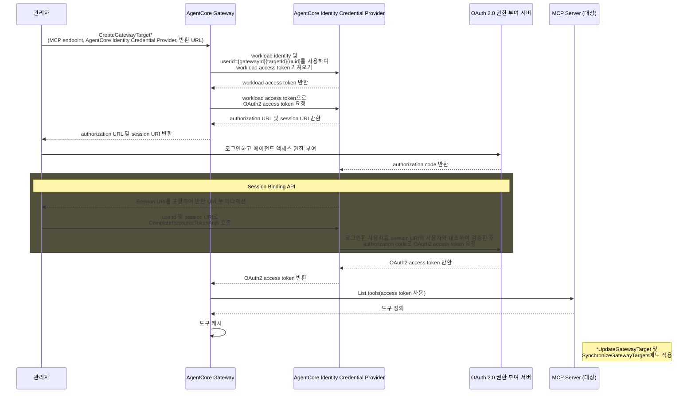

```mermaid
sequenceDiagram
    participant Admin as 관리자
    participant Gateway as AgentCore Gateway
    participant Cred as AgentCore Identity Credential Provider
    participant IdP as OAuth 2.0 권한 부여 서버
    participant MCP as MCP Server (대상)

    Admin->>Gateway: CreateGatewayTarget*<br/>(MCP endpoint, AgentCore Identity Credential Provider, 반환 URL)
    Gateway->>Cred: workload identity 및<br/>userid={gatewayId}{targetId}{uuid}를 사용하여<br/>workload access token 가져오기
    Cred-->>Gateway: workload access token 반환
    Gateway->>Cred: workload access token으로<br/>OAuth2 access token 요청
    Cred-->>Gateway: authorization URL 및 session URI 반환
    Gateway-->>Admin: authorization URL 및 session URI 반환

    Admin->>IdP: 로그인하고 에이전트 액세스 권한 부여
    IdP-->>Cred: authorization code 반환
    rect rgb(80, 80, 60)
        Note over Admin, IdP: Session Binding API
        Cred-->>Admin: Session URI를 포함하여 반환 URL로 리디렉션
        Admin->>Cred: userid 및 session URI로<br/>CompleteResourceTokenAuth 호출
        Cred->>IdP: 로그인한 사용자를 session URI의 사용자와 대조하여 검증한 후<br/>authorization code로 OAuth2 access token 요청
    end
    IdP-->>Cred: OAuth2 access token 반환
    Cred-->>Gateway: OAuth2 access token 반환
    Gateway->>MCP: List tools(access token 사용)
    MCP-->>Gateway: 도구 정의
    Gateway->>Gateway: 도구 캐시

    Note right of MCP: *UpdateGatewayTarget 및<br/>SynchronizeGatewayTargets에도 적용
```
