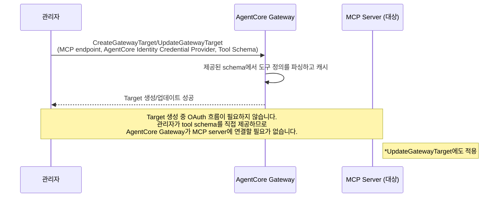

```mermaid
sequenceDiagram
    participant Admin as 관리자
    participant Gateway as AgentCore Gateway
    participant MCP as MCP Server (대상)

    Admin->>Gateway: CreateGatewayTarget/UpdateGatewayTarget<br/>(MCP endpoint, AgentCore Identity Credential Provider, Tool Schema)
    Gateway->>Gateway: 제공된 schema에서 도구 정의를 파싱하고 캐시
    Gateway-->>Admin: Target 생성/업데이트 성공

    Note over Admin, MCP: Target 생성 중 OAuth 흐름이 필요하지 않습니다.<br/>관리자가 tool schema를 직접 제공하므로<br/>AgentCore Gateway가 MCP server에 연결할 필요가 없습니다.

    Note right of MCP: *UpdateGatewayTarget에도 적용
```
