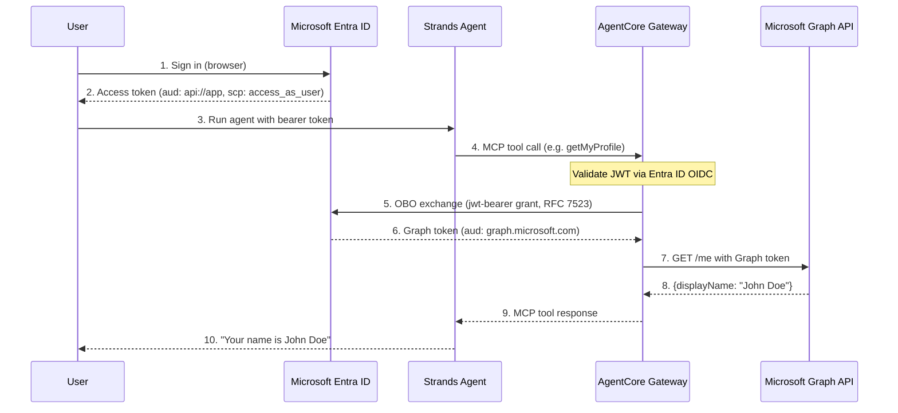

# AgentCore Gateway + Microsoft Graph API를 사용한 OBO Token Exchange

## 개요

이 실습에서는 **On-Behalf-Of(OBO) token exchange**와 함께 **Amazon Bedrock AgentCore Gateway**를 사용하여 Microsoft Graph API 엔드포인트를 MCP 도구로 노출하는 방법을 보여줍니다. 에이전트 코드에는 토큰 처리 로직이 전혀 없으며 Gateway가 인프라 수준에서 OBO exchange를 투명하게 처리합니다.

OBO token exchange를 사용하면 추가 동의 흐름을 시작하지 않고도 에이전트가 인증된 사용자를 대신해 보호된 리소스에 액세스할 수 있습니다. Gateway는 JWT Authorization Grant(RFC 7523)를 사용해 인바운드 사용자의 access token을 다운스트림 resource server(Microsoft Graph)용으로 scope가 지정된 새 access token으로 교환합니다.

### 작동 방식

1. 사용자가 **Microsoft Entra ID**로 직접 인증하고 앱으로 scope가 지정된 access token(`api://<client-id>/access_as_user`)을 받습니다.
2. 사용자가 해당 Entra ID 토큰을 bearer로 **AgentCore Gateway**에 전달합니다.
3. Gateway가 Entra ID의 OIDC discovery URL을 사용해 토큰을 검증합니다(inbound auth).
4. Gateway가 **OBO token exchange**를 수행하여 JWT Authorization Grant(RFC 7523)를 사용해 앱으로 scope가 지정된 Entra ID 토큰을 Microsoft Graph 토큰으로 교환합니다.
5. **Strands Agent**가 Gateway MCP URL에 연결하여 도구를 탐색하고 호출합니다.

### 아키텍처

### 주요 개념

**`MicrosoftOAuth2`가 아닌 `CustomOauth2`를 사용하는 이유는 무엇인가요?** `onBehalfOfTokenExchangeConfig` 파라미터는 내장 Microsoft provider가 아닌 `customOauth2ProviderConfig` 내부에서만 사용할 수 있습니다.

**customParameters에 `requested_token_use: on_behalf_of`가 필요한 이유는 무엇인가요?** Entra ID의 token endpoint에서 OBO exchange를 수행하려면 이 파라미터가 필요합니다. 이 파라미터가 없으면 exchange가 메시지 없이 실패합니다.

**v1.0 discovery URL을 사용하는 이유는 무엇인가요?** Entra ID는 기본적으로 v1.0 access token을 발급합니다(issuer: `sts.windows.net`). Gateway의 inbound auth discovery URL은 토큰 버전과 일치해야 합니다.

### 실습 세부 정보

| 정보                 | 세부 정보                                                                |
|:---------------------|:-------------------------------------------------------------------------|
| 실습 유형            | 대화형                                                                   |
| AgentCore 구성 요소  | AgentCore Gateway, AgentCore Identity                                    |
| 에이전트 프레임워크  | Strands Agents                                                           |
| LLM 모델             | Anthropic Claude Haiku 4.5                                               |
| 실습 구성 요소       | OBO Token Exchange를 사용하는 AgentCore Gateway, Microsoft Graph API    |
| 실습 분야            | 산업 공통                                                                |
| 예제 난이도          | 보통                                                                     |
| 사용 SDK             | boto3, strands-agents, mcp                                               |
| Credential Provider  | JWT_AUTHORIZATION_GRANT OBO config를 사용하는 CustomOauth2               |
| Inbound Auth         | Entra ID OIDC (CUSTOM_JWT)                                               |
| Gateway Target       | OpenAPI Schema(Microsoft Graph API)                                      |

## 사전 요구 사항

- Python 3.10+
- 구성된 AWS 자격 증명
- Microsoft Entra ID에 액세스할 수 있는 Microsoft 365 **회사 또는 학교 계정**

> ⚠️ **개인 Microsoft 계정**(`@outlook.com`, `@hotmail.com`, `@live.com`)은 calendar/email 엔드포인트에서 작동하지 않습니다. OBO exchange 자체는 작동하지만 Microsoft Graph calendar 및 mail 엔드포인트에는 Exchange Online mailbox가 필요합니다(회사/학교 계정만 해당). `/me` profile 엔드포인트는 모든 계정 유형에서 작동합니다.

## 실습

- [AgentCore Gateway + Microsoft Graph API를 사용한 OBO Token Exchange](obo_token_exchange_microsoft.ipynb)

## 참고 문서

- [OBO Token Exchange](https://docs.aws.amazon.com/bedrock-agentcore/latest/devguide/on-behalf-of-token-exchange.html)
- [Gateway Outbound Auth](https://docs.aws.amazon.com/bedrock-agentcore/latest/devguide/gateway-outbound-auth.html)
- [Microsoft Entra ID OBO Flow](https://learn.microsoft.com/en-us/entra/identity-platform/v2-oauth2-on-behalf-of-flow)
