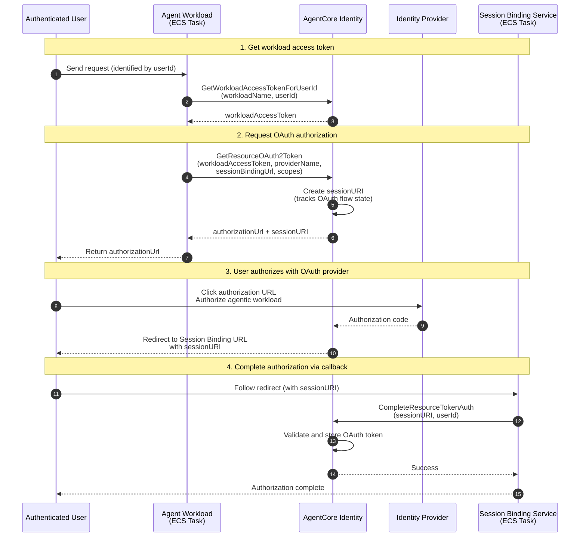

# Amazon ECS에서 AgentCore Identity 및 3LO 사용

이 샘플에서는 **Authorization Code Grant(3-legged OAuth) 흐름**에 **[Amazon Bedrock AgentCore Identity](https://docs.aws.amazon.com/bedrock-agentcore/latest/devguide/identity-getting-started.html)**를 사용하는 AI 에이전트를 Amazon ECS Fargate에서 구축하는 방법을 보여 줍니다. 에이전트는 인증된 사용자를 대신해 GitHub 같은 외부 서비스에 안전하게 액세스할 수 있습니다.

## 아키텍처


1. 요청은 Amazon Application Load Balancer에 도착합니다. 로드 밸런서는 [ALB OIDC 인증 흐름](https://docs.aws.amazon.com/elasticloadbalancing/latest/application/listener-authenticate-users.html)을 통해 사용자를 인증합니다. Identity Provider로는 [Microsoft Entra ID](https://learn.microsoft.com/en-gb/entra/fundamentals/what-is-entra)를 사용하지만, 모든 OIDC 호환 Identity Provider를 지원합니다. 트래픽은 HTTPS로 암호화되며, 이를 위해 Amazon Route 53의 퍼블릭 호스팅 영역과 Amazon Certificate Manager의 인증서가 필요합니다. 호스팅 영역의 A 레코드(별칭)가 트래픽을 로드 밸런서로 라우팅합니다. 로드 밸런서는 Agentic Workload와 Session Binding Service라는 두 서비스로 구성된 ECS 클러스터의 프런트엔드 역할을 합니다. 로드 밸런서는 JSON Web Token(JWT) 형식의 사용자 claim이 포함된 `x-amzn-oidc-data` 헤더를 전달하며, `sub` 필드를 통해 사용자를 고유하게 식별할 수 있습니다.
2. Agentic Workload는 `/invocations` 메서드를 제공하는 [FastAPI](https://fastapi.tiangolo.com/) 서버입니다. 이 메서드는 `sessionId`와 `message`를 입력으로 받아 Strands Agents로 구현된 에이전트에 전달합니다. 요청 수신은 에이전트 SDK와 독립적으로 FastAPI 서버에서 처리되므로 LangChain이나 LangGraph 같은 다른 에이전트 SDK도 사용할 수 있습니다. 에이전트는 Amazon Bedrock의 LLM을 호출하고, 사용자 간 세션을 격리하도록 사용자의 `sub` claim을 키 접두사로 사용해 Amazon S3 버킷에 세션을 저장합니다. 또한 사용자의 액세스 토큰을 사용하여 GitHub에서 사용자를 대신해 작업을 수행하는 도구를 제공합니다.
3. Amazon Bedrock AgentCore Identity(AC Identity)는 Agentic Workload에 워크로드 ID를 제공하고 GitHub의 OAuth 공급자 구성을 제공합니다. 이 구성에는 GitHub의 well-known 구성과 GitHub에 등록된 앱의 자격 증명이 포함됩니다. 이를 통해 에이전트는 AC Identity Token Vault에서 액세스 토큰을 가져올 수 있습니다. 액세스 토큰이 없거나 만료 또는 취소된 경우 AC Identity는 사용자가 Authorization Server에서 액세스를 승인할 수 있는 권한 부여 URL과 흐름을 식별하는 세션 URI를 반환합니다.
4. 사용자가 GitHub에서 권한 부여를 완료하면 Session Binding Service가 콜백 URL을 처리합니다. 콜백 URL의 세션 ID와 `x-amzn-oidc-data` 헤더의 `sub`를 가져와 OAuth 흐름을 완료합니다.
5. 최종 사용자는 OpenAPI 명세를 HTML로 렌더링하는 `/docs` 엔드포인트를 통해 Agentic Workload를 호출합니다. 이 엔드포인트는 데모에 충분한 최소한의 UI 역할을 합니다.

로그는 Amazon CloudWatch에 캡처되며, 로드 밸런서와 S3 버킷의 액세스 로그는 전용 S3 버킷에 저장됩니다. ECS 서비스의 컨테이너 이미지는 Amazon ECR에 저장되고 여기에서 가져옵니다. 일반적인 웹 공격에 대한 기본 보호를 제공하도록 로드 밸런서에 기본 AWS WAF 규칙 세트가 연결됩니다. 서비스 요구 사항에 따라 Amazon S3 관리형 암호화(SSE-S3)를 사용하는 액세스 로그 버킷을 제외한 모든 데이터는 Amazon KMS 고객 관리형 키(CMK)로 암호화됩니다.


### Authorization Code Grant 흐름

에이전트가 사용자를 대신해 외부 서비스에 액세스해야 하는 경우 [OAuth 2.0 권한 부여 URL 세션 바인딩](https://docs.aws.amazon.com/bedrock-agentcore/latest/devguide/oauth2-authorization-url-session-binding.html)을 참조하세요.

1. 에이전트가 AgentCore Identity에 액세스 토큰을 요청합니다.
2. 유효한 토큰이 없으면 AgentCore가 권한 부여 URL을 반환합니다.
3. 사용자가 URL을 클릭하고 외부 서비스(예: GitHub)로 인증합니다.
4. 외부 서비스가 Session Binding Service 엔드포인트로 리디렉션합니다.
5. Session Binding Service가 `complete_resource_token_auth()`를 호출하여 토큰을 사용자에게 바인딩하고 흐름을 완료합니다.
6. 이후 에이전트 요청에서는 사용자의 액세스 토큰을 자동으로 받습니다.

## 핵심 개념

- **워크로드 액세스 토큰**: 워크로드 ID와 사용자를 나타내며 인증에 사용하는 토큰(workloadIdentityToken)
- **세션 URI**: OAuth2 인증 프로세스 중 여러 요청과 응답에 걸쳐 권한 부여 흐름 상태 추적
- **Token Vault**: OAuth 토큰이 저장되는 안전한 저장소
- **Session Binding Service**: 리소스의 OAuth2.0 토큰을 얻기 위해 사용자 인증 세션 확인

## 흐름 단계

1. **워크로드 액세스 토큰 가져오기**: 워크로드가 자신과 사용자를 모두 나타내는 토큰을 AgentCore Identity에서 가져옵니다.
2. **OAuth 권한 부여 요청**: 워크로드가 OAuth 토큰을 요청하고 권한 부여 URL을 받습니다.
3. **사용자가 OAuth 공급자에서 권한 부여**: 사용자가 서드 파티 도구의 리소스에 워크로드가 액세스하도록 권한을 부여합니다.
4. **세션 바인딩을 통해 권한 부여 완료**: Session Binding Service가 사용자 인증 세션을 확인하고 토큰 바인딩을 완료합니다.



더 자세한 흐름 다이어그램은 다음 문서를 참조하세요.
- [인바운드 인증 흐름](docs/inbound.md) - Entra ID를 사용한 ALB OIDC 인증
- [아웃바운드 권한 부여 흐름](docs/outbound.md) - AgentCore Identity를 사용한 GitHub OAuth

## 사전 요구 사항

이 샘플을 배포하기 전에 다음 항목을 준비하세요.

- 적절한 자격 증명으로 구성된 [AWS CLI](https://docs.aws.amazon.com/cli/latest/userguide/getting-started-install.html) v2.27+
- 설치된 [AWS CDK](https://docs.aws.amazon.com/cdk/v2/guide/getting-started.html) v2(`npm install -g aws-cdk`)
- [uv](https://docs.astral.sh/uv/)
- [Python 3.12+](https://www.python.org/downloads/)
- 컨테이너 이미지 빌드용 [Docker](https://docs.docker.com/get-docker/)
- 도메인의 [Amazon Route 53](https://docs.aws.amazon.com/Route53/latest/DeveloperGuide/Welcome.html) 호스팅 영역
- Claude 모델이 활성화된 [Amazon Bedrock](https://docs.aws.amazon.com/bedrock/latest/userguide/getting-started.html) 액세스 권한
- 사용자 인증을 위한 OIDC 호환 Identity Provider(IdP)

### OIDC Identity Provider

이 샘플이 올바르게 작동하려면 OIDC 자격 증명이 필요합니다.

#### 선택 사항: 사용할 OIDC Identity Provider가 없는 경우 Entra ID OAuth 애플리케이션 생성

Entra ID(Azure AD) 테넌트에 OAuth 애플리케이션을 생성합니다.

1. **Entra ID 열기**: [portal.azure.com](https://portal.azure.com)으로 이동하여 "Microsoft Entra ID"를 검색합니다.
2. **앱 등록**: 왼쪽 사이드바에서 Manage > App registrations를 클릭합니다.
3. **새 등록**: New registration을 클릭합니다.
4. **등록 구성**:
   - **Name**: `AWS-ALB-SingleTenant`(또는 원하는 이름)
   - **Supported Account Types**: "Single tenant only" 선택
   - **Redirect URI**:
     - 드롭다운에서 "Web" 선택
     - 입력: `https://agent-3lo.<your-domain>/oauth2/idpresponse`
5. **등록**: 하단의 Register 버튼을 클릭합니다.

6. 등록 후 Certificates & secrets로 이동합니다.
7. New client secret을 클릭합니다.
8. 설명을 추가하고 만료 기간을 설정합니다.
9. Add를 클릭하고 보안 암호 값을 즉시 복사합니다. 이후에는 다시 볼 수 없습니다.

완료하면 TENANT_ID, CLIENT_ID 및 CLIENT_SECRET이 있어야 합니다.

OIDC Identity Provider 엔드포인트는 Tenant ID에 따라 달라집니다. 정확한 패턴은 [Entra ID의 Well Known Configuration](https://login.microsoftonline.com/common/v2.0/.well-known/openid-configuration)에서 확인할 수 있습니다. 자세한 내용은 [앱의 OpenID 구성 문서 URI 찾기](https://learn.microsoft.com/en-us/entra/identity-platform/v2-protocols-oidc#find-your-apps-openid-configuration-document-uri) 가이드를 참조하세요.

아래 구성 단계에서 이 정보를 사용할 수 있습니다.

##### OIDC 클라이언트 자격 증명 저장

이전 단계의 클라이언트 보안 암호와 ID를 AWS Secrets Manager에 저장합니다.

```shell
aws secretsmanager create-secret --name "agent-oauth/credentials" \
--secret-string '{"client_id":"<your-client-id>","client_secret":"<your-client-secret>"}' \
--region <your-deployment-region>
```

### GitHub OAuth App(AgentCore Identity용)

[GitHub Identity Provider 설정 가이드](https://docs.aws.amazon.com/bedrock-agentcore/latest/devguide/identity-idp-github.html)에 따라 GitHub OAuth App을 생성하고 AgentCore Identity에 등록합니다.

## 구성

일부 기본값은 `config.py`에 설정되어 있습니다. DNS 및 OIDC 자격 증명은 아래 설명과 같이 `.env` 파일을 통해 구성합니다.

`config.py` 주요 설정:

| 파라미터 | 설명 | 기본값 |
|-----------|-------------|---------|
| `aws_region` | 기본 스택(ECS, ALB)의 리전 | `eu-west-1` |
| `identity_aws_region` | AgentCore Identity의 리전 | `eu-central-1` |
| `suffix` | 리소스 이름의 접미사 | `sample` |
| `inference_profile_id` | Bedrock 추론 프로필 | `eu.anthropic.claude-haiku-4-5-20251001-v1:0` |

### OIDC 구성

프로젝트 루트에 IdP 엔드포인트가 포함된 `.env` 파일을 생성합니다. 이 값은 IdP의 `.well-known/openid-configuration` 엔드포인트에서 확인할 수 있습니다.

```shell
cat <<EOF > .env
OIDC_ISSUER=<issuer-url>
OIDC_AUTHORIZATION_ENDPOINT=<authorization-endpoint>
OIDC_TOKEN_ENDPOINT=<token-endpoint>
OIDC_USER_INFO_ENDPOINT=<userinfo-endpoint>
OIDC_SECRET_NAME=agent-oauth/credentials
OIDC_SCOPE=openid email profile
EOF
```

<details>
<summary>예제: Entra ID(Azure AD) 구성</summary>

`<TENANT_ID>`를 Entra ID 테넌트 ID로 바꾸세요.

```shell
cat <<EOF > .env
OIDC_ISSUER=https://login.microsoftonline.com/<TENANT_ID>/v2.0
OIDC_AUTHORIZATION_ENDPOINT=https://login.microsoftonline.com/<TENANT_ID>/oauth2/v2.0/authorize
OIDC_TOKEN_ENDPOINT=https://login.microsoftonline.com/<TENANT_ID>/oauth2/v2.0/token
OIDC_USER_INFO_ENDPOINT=https://graph.microsoft.com/oidc/userinfo
OIDC_SECRET_NAME=agent-oauth/credentials
OIDC_SCOPE=openid email profile
EOF
```

</details>

### Amazon Route 53 호스팅 영역

도메인에 대한 [Amazon Route 53](https://docs.aws.amazon.com/Route53/latest/DeveloperGuide/Welcome.html) 호스팅 영역이 필요합니다. `.env` 파일에 다음 내용을 추가합니다.

```shell
cat <<EOF >> .env
DNS_DOMAIN_NAME=your-domain.example.com
DNS_HOSTED_ZONE_ID=YOUR-HOSTED-ZONE-ID
EOF
```


## 배포

사전 요구 사항을 검증하고 스택을 배포하는 배포 스크립트를 사용합니다.

```shell
# 종속성 설치
uv sync --all-groups

# 배포 스크립트 실행
./deploy_sample.sh
```

배포 후 `https://agent-3lo.<your-domain>`에서 에이전트에 액세스합니다.

## 테스트

[tests](./tests/)에 몇 가지 테스트가 제공됩니다. [Moto](https://docs.getmoto.org/en/latest/)를 사용해 [boto3](https://docs.aws.amazon.com/boto3/latest/) API 호출을 모의합니다. 아직 Moto에 구현되지 않은 일부 API 호출은 직접 패치합니다. [conftest.py](./tests/conftest.py)의 `mock_bedrock_api_call`을 참조하세요.

`uv run pytest tests` 명령으로 테스트를 실행할 수 있습니다.

## 보안

- 모든 보안 암호는 동적 참조를 사용하여 AWS Secrets Manager에 저장
- ACM 인증서를 사용하는 ALB를 통해 HTTPS 적용
- OIDC IdP가 ALB를 통해 사용자 인증 처리
- AgentCore Identity가 사용자별 OAuth 토큰을 안전하게 관리
- Amazon CloudWatch Logs 및 민감한 데이터에 AWS KMS 암호화 적용
- Amazon ECS 작업에 프라이빗 서브넷이 있는 Amazon VPC 사용

## 추가 보안 고려 사항

[보안 고려 사항](security_considerations.md)을 참조하세요.

## 정리

배포된 모든 리소스를 제거하려면 다음 명령을 실행합니다.

```shell
uv run cdk destroy --all
```

**참고:** 다음 항목은 수동으로 삭제해야 할 수 있습니다.

- Amazon S3 버킷 콘텐츠(비어 있지 않은 경우)
- Amazon CloudWatch 로그 그룹
- AWS Secrets Manager 보안 암호

## 라이선스

이 라이브러리는 MIT-0 License에 따라 라이선스가 부여됩니다. [LICENSE](LICENSE) 파일을 참조하세요.
